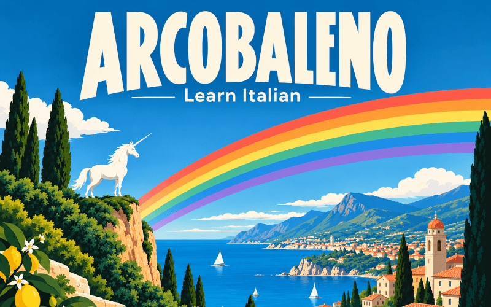

# 🌈 Arcobaleno - Learn Italian

# [PLAY ARCOBALENO 🦄](https://killedbyapixel.github.io/Arcobaleno/)

# [OFFICIAL JS13K PAGE](https://js13kgames.com/2026/games/arcobaleno-learn-italian)

A daily Italian practice game in 13 kilobytes. Seven small games, one per
colour of the rainbow: answer ten questions and that colour lights up. Fill
all seven and your unicorn coach gallops over the rainbow. Tomorrow it starts
faded again, and your streak keeps counting.

**Chrome is recommended**: it ships its own Italian voice. Other browsers use
the voices on your device, and without an Italian one the words come out in the
wrong accent — the game tells you when that happens. Add a voice in Settings:
Time & Language > Speech (Windows), Accessibility > Spoken Content (macOS and
iOS), Text-to-speech output (Android).

**There is no English anywhere.** Emoji carry the meaning, so you learn by
playing rather than translating. Every answer is a tap: no typing, no timers.

**What's inside**

- 353 nouns with the right article and plural
- 24 adjectives and 13 colours that agree in gender and number
- 108 verbs, 19 irregular: presente, passato prossimo, imperfetto, futuro
- Numbers into the millions, written and spoken
- Sentences built fresh, never from a list
- Six levels per skill, rising and falling with how you play

**The seven arcs**

- **Parole** picture to word, and back
- **Articoli** il, lo, la, l', plurals, un/uno/una, then al, dello, nell'
- **Numeri** read them, hear them, build them from parts
- **Verbi** conjugation across all four tenses
- **Frasi** build a sentence from tiles: 🐱🐱⚫🍕 is *i gatti neri mangiano la pizza*
- **Ascolto** hear a word, a number, or a whole sentence
- **Ripasso** spaced repetition of everything you got wrong

An eighth card is your **Dizionario**: every word you have met. Tap one to
hear it spoken.

Your coach is a unicorn called Baleno. She asks once whether to call you
*Bravo* or *Brava*, teaching adjective agreement in ten seconds.

Offline, no account, nothing to install. Progress lives in your browser.

Created by Frank Force for js13kGames 2026.
